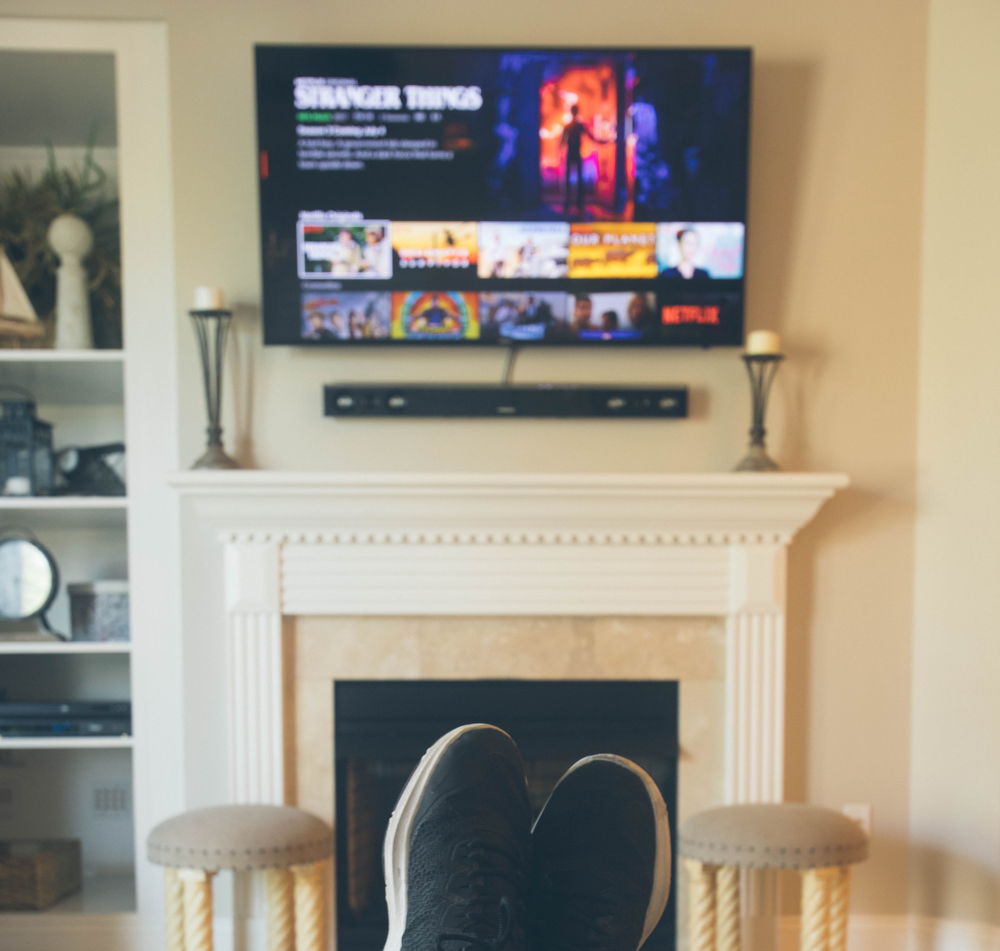

*Atomic Habits* by James Clear could not be a more timely read. I recently had a meeting with my director of schools [Dr. Jeff Moorhouse](https://twitter.com/drjmoorhouse) (read his blog at [drjmoorhouse.blogspot.com](https://drjmoorhouse.blogspot.com/)). It was a meeting totally unrelated to James Clear's book. Still, being the great leader he is, Dr. Moorhouse took the time to mentor me and recommend Atomic Habits. 

Dr. Moorhouse suggested I check it out, and he nailed it! This book was 100% what I needed. A little over a week later, we are dealing with school closures for the Covid-19 crisis. The insights James Clear shares could not be more applicable to a home-work environment. The unstructured time and disruption to routine demands discipline and good habits.

https://twitter.com/dnbailey/status/1237535323581644800

*Atomic Habits* is a conglomeration of different strategies and techniques to build good habits and squelch bad ones. As I end the first week of quarantine from my classroom, it's really got me thinking about what happens if this continues. How will I teach from home? How does virtual learning change the way I build relationships and design lessons? How do I keep from just sitting on the couch binch watching Netflix and eating potato chips?

As a teacher facing a brave new world, I want to be the designer not just the consumer. One of the few things we have control over right now is our home environment. Learning requires focus. Often our home environments are anything but focused. Over the next week I'm going to work on my remote teaching environment. I want to remove distractions and activate my foucs in this space. James Clear has some additional suggestions on his blog post [*Motivation is Overvalued. Environment Often Matters More.*](https://jamesclear.com/power-of-environment).

One of the tough things for students is working at home is that the environments they will be working in are not something the associate with school. Being near the TV means video games or binge watching. Bedrooms are messy places for sleep. Maybe they don't even have a space to themselves. Clear suggests that even designating a corner can create space for a new habit. 

Additionally, Clear suggests that we need to ease in to new habits. No one runs a marathon on day one. You have to start somewhere. Even 5 mins is working in the right direction. We have to ease our students in to virtual work. Build that habit slowly and it will stick. Make it too painful early on and bad habits will win out.

Clear goes on in the book to suggest "habit stacking" which rewards new habits be pariing them with pleasant ones. Find something you enjoy doing and pair it with a new one you are trying to form. I love a good cup of coffee. Logging in to check student's progress on vitual work can be paired with my morning cup of coffee. By creating this pairing, I associate a new habit with a pleasant habit I already have.

James Clear's book is chock-full of actionable suggestions for building new habits. Download it or order a paper copy to get more insights. It's totally worth it, and I'm still unpacking everything from this gold mine. 