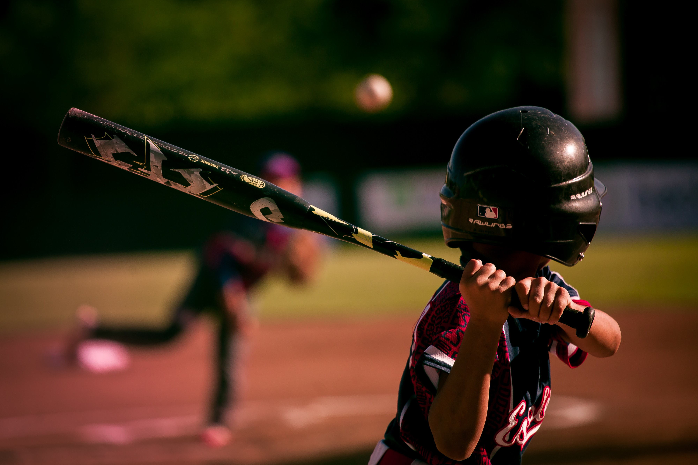

Today I had the opportunity to hear to Dr. Sarah Fine speak on the potential of High School education. Her presentation was part of a SCORE institute on transforming secondary education and coincided with their release of a [critical report on High School in Tennessee](https://tnscore.org/wp-content/uploads/2019/07/What-High-School-Could-Be-2019.pdf).

I believe the report concludes what many secondary educators experience every day: students are disengaged and under-challenged. Dr. Fine and SCORE both did research into what causes this disengagement and how innovative schools are overcoming this barrier to deep learning. The challenge is real, and the solutions are nuanced. There is definitely no silver bullet, but there are rays of hope.

One of the biggest takeaways I had from the event was the idea that we must create compelling educational experiences, not just effective ones. We have a responsibility to inspire as well as educate. My mentor Dr. Shadden is continually pushing me to find projects with purpose. I saw some incredible examples of this in action during Dr. Fine’s presentation.

During the presentation, she showcased a project at High Tech High in California called Xonr8, where students partnered with the California Innocence Project. Students got to witness the legal system at work, and their work had a direct impact on real people. They were tasked with reviewing a real person’s criminal case and making a recommendation to a group of lawyers on the viability of an appeal on the grounds of wrongful conviction. Talk about a project with a purpose. I got goosebumps thinking about the real influence and impact these teenagers had.

### Co-Constructors

We have to step out of the traditional role of being the sole source of knowledge and start getting our hand’s dirty learning with students. Students need to see adults learning every day. Projects like Xonr8 provide a platform for learning with students. Not only does it provide context to learning facts and skills, but it humanizes education. Learning is, ultimately, a human endeavor. As a result, it is messy and unpredictable.
Learning must be transformed from fixed knowledge to a co-constructed experience. This process requires careful planning and collaboration with industry and the community. We cannot hope to accomplish such a daunting task in isolation. We need to develop an inclusive and diverse community that supports all students experiencing real and authentic learning.

### “Whole Game at the Junior Level.”

Another thing that really stuck with me is the idea that students need to play the whole game. Dr. Fine described it using an analogy to sports — specifically baseball. We go watch kids play ball all the time, but we implicitly know that the performance will be at a junior level. They still play the game! They don’t just practice batting and pitching in isolation.
As educators, how often do we have students spend weeks practicing skills without ever playing the game? The game is where the real learning takes place. It’s okay if the game isn’t perfect. We should expect a junior level performance at first, but the students must play the whole game.

> Embrace the notion of productive struggle—your powerful learning experience likely wasn’t spoon-fed to you step-by-step. Give your students different roles, teach them the standards of your field, and have them give feedback to each other as they’re developing their work. — Sarah Fine, Jal Mehta on [Edutopia.org](https://www.edutopia.org/article/promoting-deeper-learning-high-school)

### Standards from the Field

Dr. Fine mentioned the concept of ‘standards from the field,’ which immediately clicked for me. We know that high expectations and standards have a tremendous effect on performance. How often do we miss the opportunity to connect with the authentic standards from industry and the “real-world”?

We need to explore ways of exposing the students to the standards of professionals. With baseball, it’s easy. Everyone loves seeing a pro hit one out of the park. Every kid playing youth sports dreams of having that moment, and they practice and play to experience it. We need to help students see what it means to be a professional in all fields. We need them to see diverse examples of rock star mathematicians, poets, chemists, and computer scientists, so they can push themselves to reach the highest standards. We can not be satisfied by meeting the minimum requirements of the curriculum.

I’m still processing all the ideas and information I was exposed to today. I’m thankful to Dr. Fine and SCORE for doing the research and starting the conversation. As an educator, I feel compelled to engage in this vital discussion. Teachers have the power and the skills to truly transform high school education into a powerful experience and not just an effective one.

In the meantime, check out a really cool article by Dr. Fine on [Three Strategies to Get Started Promoting Deeper Learning](https://www.edutopia.org/article/promoting-deeper-learning-high-school).
